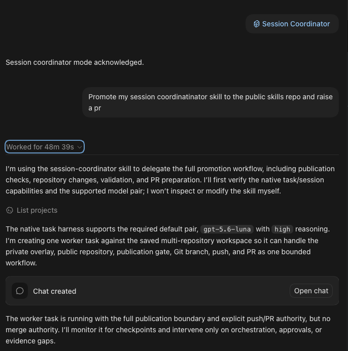

## The workflow

Codex and GitHub Copilot now expose more explicit ways to run concurrent agent work and inspect the sessions doing it.

Codex documents [subagent workflows](https://developers.openai.com/codex/agent-configuration/subagents) that spawn specialized agents, collect their results, and expose the individual agent threads.

GitHub Copilot documents [multiple isolated agent sessions](https://docs.github.com/en/copilot/how-tos/github-copilot-app/agent-sessions), as well as [custom-agent orchestration within a parent session](https://docs.github.com/en/copilot/how-tos/copilot-sdk/features/custom-agents).

Since those capabilities landed, I’ve mostly stopped treating delegation as a black box.

I can jump into an individual worker thread, talk to it directly, inspect what it is doing, and redirect it when necessary. The coordinator passes context and results between workers while keeping the overall workflow in one place.

That closes the multi-agent collaboration loop for me.

So what does my workflow look like now?

Let me introduce [session-coordinator](https://github.com/ngfizzy/skills/tree/main/skills/session-coordinator): my master/worker thread skill.

Once I call the skill in a thread, that thread stops doing implementation work itself. Its job becomes coordination.

It spins up worker threads, sequences the work, monitors progress, and validates the result. It can also decide that validation should be delegated to another fresh worker.

## Fallback behavior

My default worker model right now is gpt-5.6-luna.

There is no automatic silent fallback.

If native session support is unavailable, the skill stops and asks for my explicit permission before using a specifically named alternative, such as subagents or external delegation with a command like claude -p.

## The attention benefit

The first benefit for me is attention.

One of the advantages of agentic workflows is being able to have several workstreams running concurrently. But there is a hidden cost to that.

If I have to keep jumping between five different threads throughout the day, checking what each one is doing and remembering where I left off, the context switching starts to add up.

By the end of the day, I’m exhausted.

The coordinator session gives me one place to interact with the project. It sequences the workers and keeps me updated with what matters. When I want more detail, I can drill into an individual worker and inspect its work directly.

## The cost benefit

The second benefit is cost.

A smarter model can act as coordinator and judge while most of the actual implementation work goes to much cheaper models. That has made a noticeable difference to my token usage.

Around this point last month, I had already burned through roughly three quarters of my allotted Copilot quota at work.

This month, I’m at about one quarter.

A large part of that difference is that the expensive model is no longer doing all the work. It is deciding what work needs to happen, delegating it, and reviewing the result.

You can take a look at the skill here and use it as inspiration for your own workflow:

https://github.com/ngfizzy/skills/tree/main/skills/session-coordinator

## One side note: slop-qa

I still can’t publish slop-qa.

It is too tightly coupled to my custom test harnesses, which are themselves tightly coupled to my projects. When I strip the harness away, what remains is mostly a prompt describing how to use tools that no longer exist.

So before I can release it publicly, I need to engineer the abstraction properly rather than publish something that only makes sense inside my setup.

And that’s Friday Checkout.
