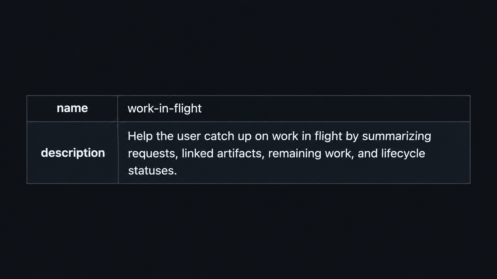

I’m always looking for ways to manage my increasingly parallelised work.

Correctness is not really my biggest problem anymore.

The problem is keeping agents on goal, making sure parallel work doesn’t quietly fall through the cracks, and being able to return to my desk and quickly understand where everything stands.

In recent weeks, there have been mornings where I kick off several agents early enough that most of them are busy for a good part of the day before I even start my 9-to-5.

Then work starts.

Aside from planned work, my team gets questions from internal users, requests from developers on other teams, PRs I need to review, alerts to triage, and the usual unexpected things that appear during the day.

A lot of those also end up delegated to agents.

The problem with parallelising work this aggressively is that it becomes incredibly easy for something to fall through the cracks.

I often find myself returning to a coordinator session and asking:

“So, where were we?”

And it gives me a debrief.

Except the quality of that debrief varies.

Sometimes it is extremely verbose.

Sometimes there isn’t enough information to know what I should continue with.

Sometimes it is useless spiel.

Sometimes it explains everything to me like I’m five.

What I actually wanted was something much more specific.

So I created a new skill called [work-in-flight.](https://github.com/ngfizzy/skills/blob/main/skills/work-in-flight/SKILL.md)

Its job is simple.

When I need to catch up, it reconstructs the work from the conversation and the available project records, checks the current artifacts and statuses where possible, and gives me a concise table showing:

- what the request was,
- the relevant artifacts,
- what still remains,
- and the current status.

It also distinguishes between statuses it can verify and ones it has to infer.

That last bit matters.

A passing test does not mean something has been merged. A completed worker does not necessarily mean the work has shipped. And something sitting locally should not quietly become “done” just because an agent finished touching it.

I don’t need another summary of the project.

I need a reliable snapshot that lets me sit back down after a few hours away and immediately know where to put my attention.

We’re all still figuring out this agentic way of working, and I’m sharing what works for me in real time because I keep meeting very good developers who still mostly treat these tools as “just chatbots.”

Once you start running several agents across several pieces of work, the problem changes.

You need ways to manage the work around the agents too.

And that’s Friday Checkout.

Enjoy your weekend.

And if you’re reading from Germany, enjoy German Unity Day.

[Originally published on LinkedIn](https://www.linkedin.com/pulse/friday-checkout-work-flight-olufisayo-bamidele-vvylf/).
